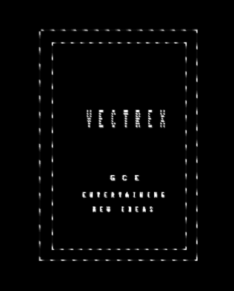
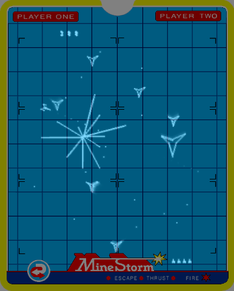

vecx-SDL2
====

 

Requirements
------------
* `sdl2`
* `sdl2_image`

Usage
-----

Authors
-------

* Valavan Manohararajah - original author
* [John Hawthorn](https://twitter.com/jhawthorn) - SDL port
* [Nikita Zimin](https://twitter.com/nzeemin) - audio
* Mateusz Muszynski - SDL2 port

